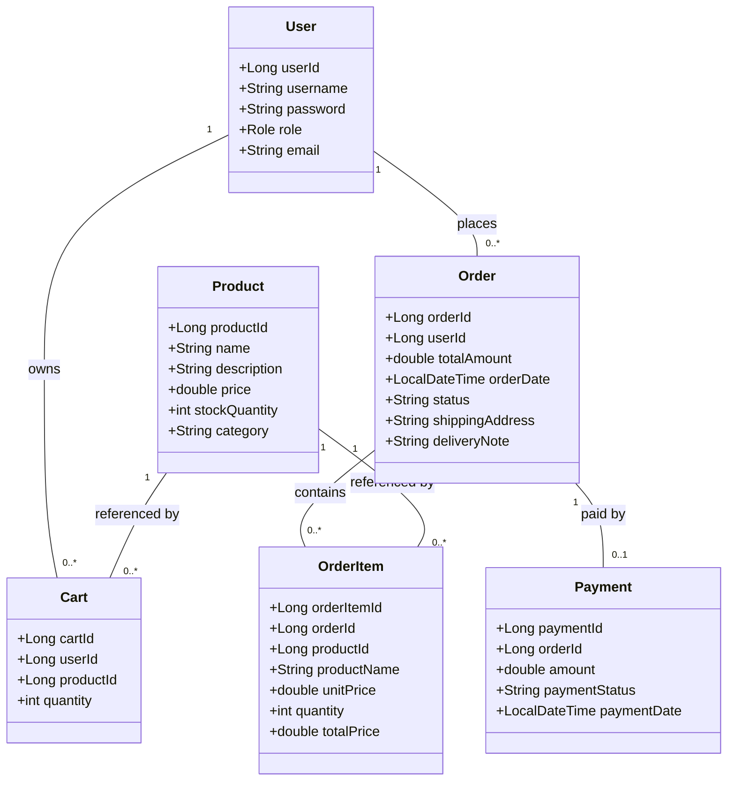
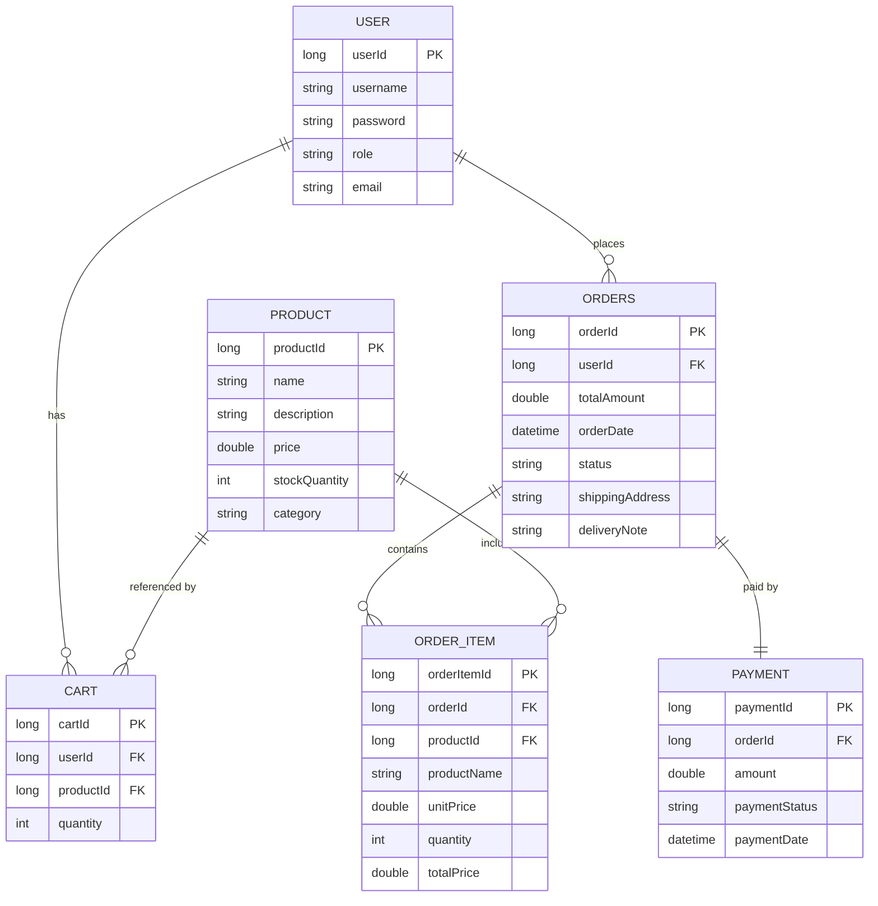
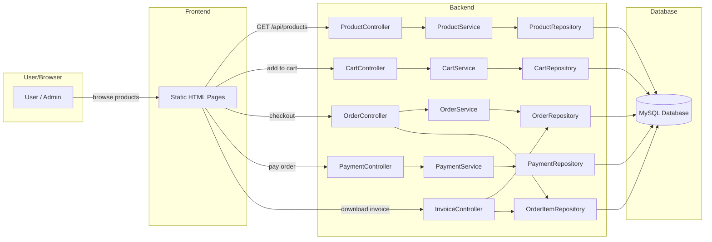
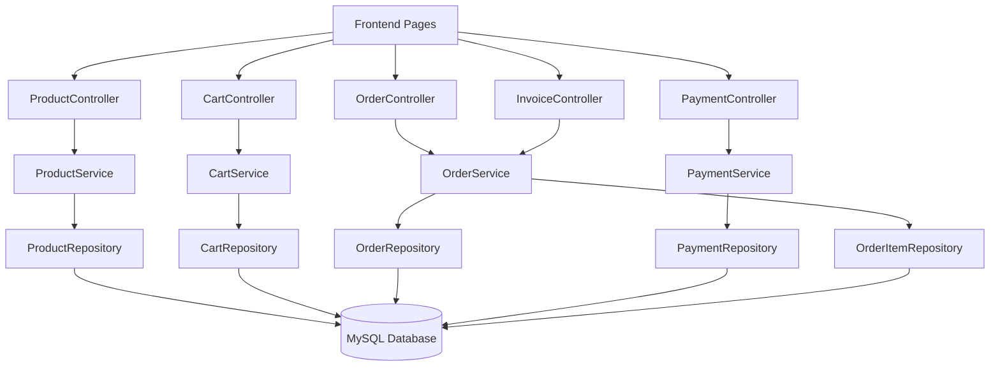

# E-Commerce Application Design Diagrams

This document provides the key architectural diagrams for the e-commerce application:
- UML Class Diagram
- ER Diagram
- Data Flow Diagram
- Database Connectivity Diagram

Each diagram includes relationship cardinalities and clear connection semantics.

---

## 1. UML Class Diagram

### Description
The UML class diagram shows the main entity classes in the application and their cardinality relationships.

### Classes and Relationships
- `User` 1 -> 0..* `Cart`
- `User` 1 -> 0..* `Order`
- `Product` 1 -> 0..* `Cart`
- `Order` 1 -> 0..* `OrderItem`
- `Product` 1 -> 0..* `OrderItem`
- `Order` 1 -> 0..1 `Payment`

---

## 2. ER Diagram

### Description
The ER diagram displays the database tables and the foreign key relationships between them.

### Tables and Cardinalities
- `USER` 1 -> 0..* `CART`
- `USER` 1 -> 0..* `ORDERS`
- `PRODUCT` 1 -> 0..* `CART`
- `ORDERS` 1 -> 0..* `ORDER_ITEM`
- `PRODUCT` 1 -> 0..* `ORDER_ITEM`
- `ORDERS` 1 -> 0..1 `PAYMENT`

---

## 3. Data Flow Diagram

### Description
This DFD shows how the user interacts with frontend pages and how requests flow through controllers, services, repositories, and the database.

### Flow Summary
- User interacts with frontend pages.
- Frontend calls API controllers.
- Controllers call business services.
- Services delegate persistence to repositories.
- Repositories read/write the database.

---

## 4. Database Connectivity Diagram

### Description
This diagram shows how application layers connect to the database and where the data is stored.

### Connectivity Summary
- Controllers connect to Services.
- Services connect to Repositories.
- Repositories connect to the MySQL database.
- Static pages communicate with controllers via REST.

---

## 5. Relationship Summary

### Entity Cardinalities
- `User` 1 — 0..* `Cart`
- `User` 1 — 0..* `Order`
- `Product` 1 — 0..* `Cart`
- `Order` 1 — 0..* `OrderItem`
- `Product` 1 — 0..* `OrderItem`
- `Order` 1 — 0..1 `Payment`

### Database Keys
- `USER.userId` is PK
- `PRODUCT.productId` is PK
- `CART.cartId` is PK, `userId` and `productId` are FKs
- `ORDERS.orderId` is PK, `userId` is FK
- `ORDER_ITEM.orderItemId` is PK, `orderId` and `productId` are FKs
- `PAYMENT.paymentId` is PK, `orderId` is FK

---

## 6. Notes
- Because `Order` uses a separate `OrderItem` table, the order-to-items relationship is one-to-many.
- The shopping cart table stores item quantity with a many-to-one reference to product and user.
- Invoice generation is based on `Order` and `OrderItem` data.
- The database connectivity diagram shows the core path from frontend to database.
